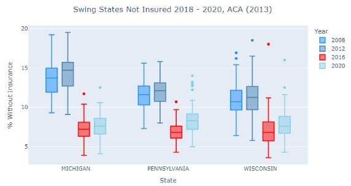

# Abstract: The Relationship between Voting Patterns and County Health Rankings

This exploratory study examines how county-level election outcomes are associated with social factors, such as access to healthcare (e.g., insurance coverage and provider availability), and socioeconomic conditions, including income and poverty levels. The primary research question addressed is: What is the relationship between voting patterns and county health ranking measures (uninsured rate, healthcare access, and median household income)?. The analysis integrated the "County Presidential Election Returns 2000-2020" from the MEDSL Dataverse with supplemental datasets, including the U.S. Census Bureau's Small Area Health Insurance Estimates (SAHIE) and estimates of poverty and income, using the Pearson correlation coefficient to observe relationships between variables. Exploratory findings suggest that Democratic Counties tend to have a higher percentage of MDs in their population, and more Republican voting counties often fall below the nation median household income of $67,340. Additionally, most Republican counties saw significantly higher levels of uninsured individuals in 2020 compared to the 2008-2016 period. The calculation of correlation between the measures of interest found a slight positive correlation between Median Household Income and Percentage of Healthcare Providers, Median Household Income and Political Affiliation, and Percentage of Healthcare Providers and Political Affiliation. It is important to note that this work calculates correlation only to observe relationships and does not determine causal relationships between these variables.

[Check out this report](DATASCI200_%20Project%202%20Final%20Report.pdf)

  

