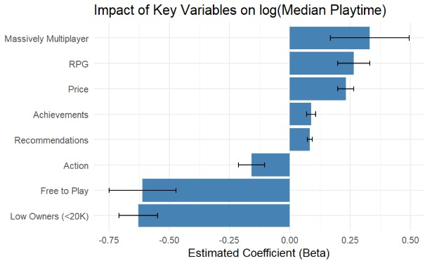

# Abstract: Factors Associated with Engagement in Entertainment-Style Video Games

This exploratory analysis aims to identify **factors associated with engagement in entertainment-style video games** by utilizing the Steam Games Dataset, which contains metadata on over 97,000 titles. **Median playtime (in minutes)** was selected as the key proxy measure for evaluating player engagement, and a conscious effort was made to focus on features that video game creators can directly or indirectly influence (such as Price, Achievements, and % Positive Reviews). After filtering the data to exclude games with zero estimated owners, zero playtime, and non-entertainment genres, the cleaned dataset was analyzed using Ordinary Least Squares (OLS) regression. The final model resulted in an adjusted $R^2$ of 0.217, supporting the themes that **higher quality games** (indicated by price, interpreted as financial resources, and recommendations, interpreted as player perception), **social elements** (such as Multiplayer and Massively Multiplayer games), and **game structure** (such as genre impact and achievements) tend to drive longer median playtimes. For instance, Roleplaying (RPG) games were played approximately 30% longer than others, while Free-to-Play games were associated with a 50% drop in playtime.

[Check out this report](lab2_final_report.pdf)

  

