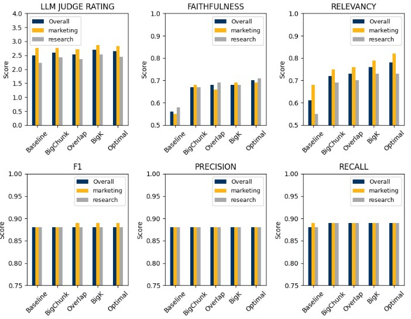

# Abstract: Customized Retrieval-Augmented Generation (CRAG) for Dual Personas

This research addresses the "custody battle" within organizational knowledge by developing a Customized Retrieval-Augmented Generation (CRAG) system designed to serve two completely incompatible personalities—Research Engineers, demanding technical precision, and Marketing Staff, needing accessible, content-ready output—from a single knowledge base. The core problem was that a single template failed to serve these "divergent objectives simultaneously". The solution was the "divorce," creating separate API endpoints, each sporting a distinct RAG template, which was a "critical advantage" because modifying the creative side did not compromise the technical integrity required by engineers. Key technical optimizations involved sensitive chunking parameters: Research Engineers achieved better precision with smaller chunks (sliced thinly), while the Marketing team required larger chunks and increased `search-k` to maintain "narrative flow". Additionally, prompt engineering emerged as "exceptionally high-leverage," utilizing one-shot examples, strict formatting, and explicit "what-not-to-do" instructions to govern the LLM. Although assessment using a refined LLM-as-Judge was achieved, it required an LLM inference call for every ruling, significantly adding to computational costs. Ultimately, this proof of concept successfully served technical depth and polished content, resulting in impressive performance gains: Faithfulness (avoiding hallucination) jumped from 0.56 to 0.70, and Relevancy soared from 0.61 to 0.78.

[Check out this report](Peter%20Liu%20-%20A5%20Paper.pdf)

  

