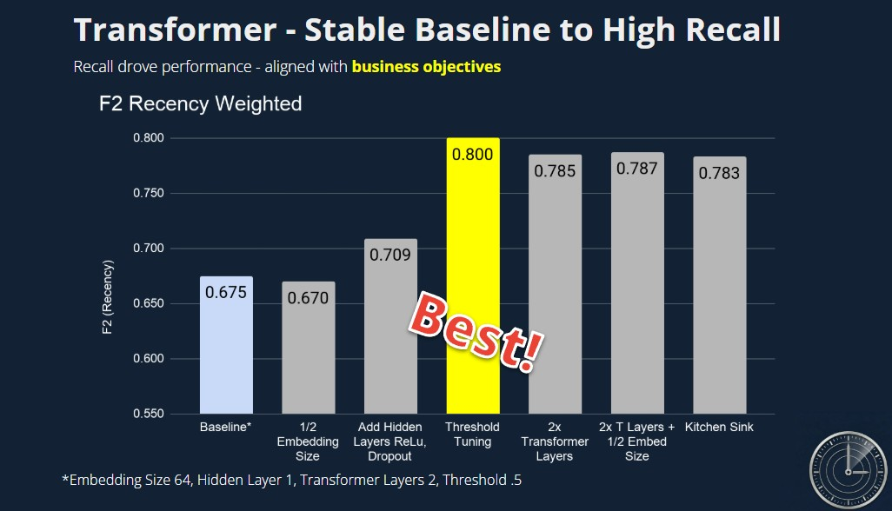

# Abstract - Delaydar

Flight delays impose significant operational and economic costs on the aviation industry, making early and accurate prediction a high-impact problem. This project develops a machine learning system to predict whether a flight will be delayed by 15 minutes or more using only information available up to two hours before departure—when intervention is still possible. The system is built on a large-scale dataset of over 25 million flight records, integrating historical operations, weather signals, and network-level features.

Our approach spans a full modeling spectrum, progressing from baseline methods—logistic regression, decision trees, random forests, and XGBoost—to advanced architectures, including a time series autoregressive (AR) model for capturing temporal weather dynamics and a transformer-based model for tabular prediction. All models were developed and trained in a distributed PySpark environment on GPU clusters, enabling scalable experimentation and cross-validation at production scale.

A key innovation lies in feature engineering: capturing cascading delay effects through tail number history, modeling system congestion via temporal and graph-based features, and incorporating atmospheric “memory” through autoregressive weather signals. The final transformer model achieves a best-in-class F2 score of 0.80, prioritizing recall to align with real-world operational costs.

Beyond predictive performance, this work demonstrates that flight delays are fundamentally a network propagation problem, not isolated events. The system provides actionable insights for airline operations, enabling proactive resource allocation, improved scheduling decisions, and reduced downstream disruptions. This end-to-end pipeline—from data ingestion to distributed model training—represents a scalable, production-ready framework for decision support in complex transportation systems.

  

