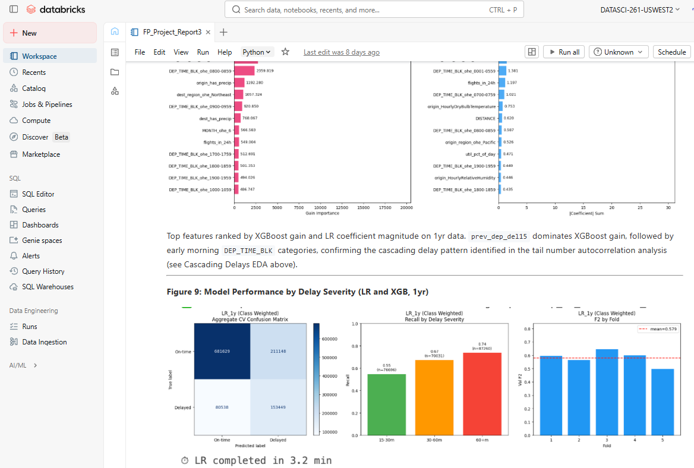

# Abstract - Delaydar

Flight delays remain a major operational and financial challenge for commercial airlines, driven not only by weather but also by cascading disruptions across aircraft, airports, and the broader flight network. In this project, we developed **Delaydar**, a machine learning system designed to predict whether a flight will depart **15 minutes or more late** using only information available **two hours before scheduled departure**. Our approach integrates large-scale flight operations data from the U.S. Bureau of Transportation Statistics with NOAA weather observations, enriched through feature engineering that captures aircraft tail-history, airport congestion, carrier performance, network centrality, holiday effects, and predicted weather conditions without data leakage.

We evaluated multiple models, including logistic regression, XGBoost, multilayer perceptron, and Transformer architectures, using an **F2 score** as the primary metric to reflect the higher business cost of missed delays relative to false alarms. Among the models tested, **XGBoost emerged as the best production candidate**, achieving the strongest balance of recall, stability, and explainability on the holdout set, while the Transformer achieved the highest recall but generated too many false positives for operational deployment. Our findings show that **delay propagation and temporal congestion signals are more predictive than weather alone**, reinforcing that departure delays are fundamentally a systems problem. Delaydar demonstrates how data science can move airline operations from reactive disruption management toward earlier, more proactive decision-making.

  

**[View the Full Project Report →](FP_Project_Report.html)**

  

  <em>Analysis conducted on the Databricks platform using unified data and analytics infrastructure</em>

