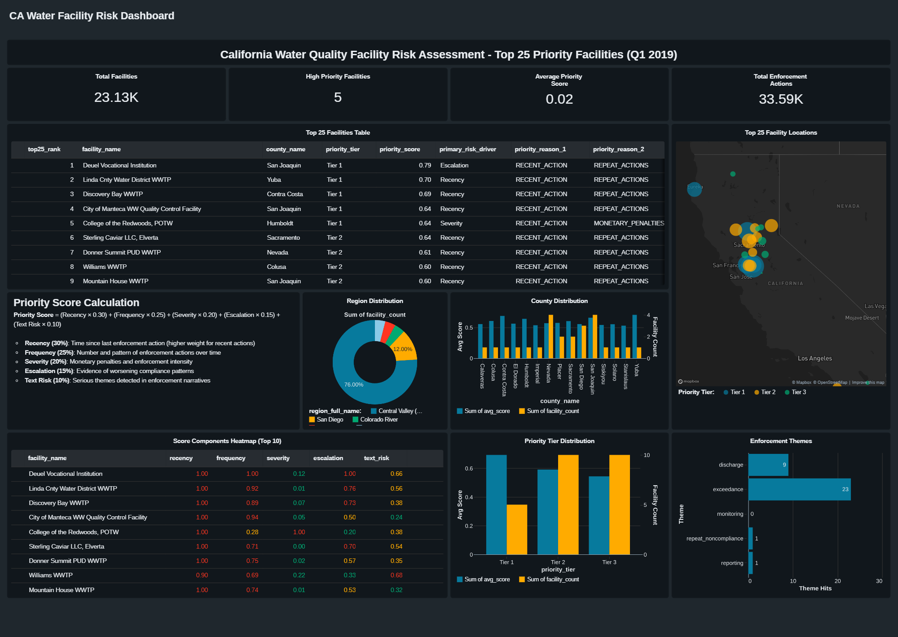
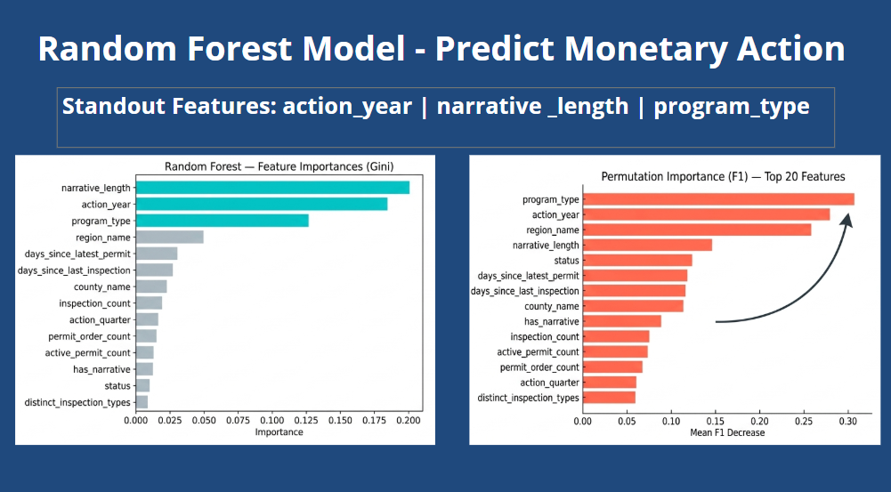

# California Water Facility Risk Prioritization: End-to-End Analytics Pipeline

## Abstract

**Background and Motivation:** California's water enforcement agencies operate under significant resource constraints, requiring systematic prioritization mechanisms for facility inspections. Current practice relies on reactive, ad-hoc planning rather than evidence-based risk assessment, resulting in inconsistent compliance outcomes and suboptimal regulatory effectiveness.

**Methodology:** This work presents an end-to-end analytics pipeline implementing a Databricks Medallion architecture to transform heterogeneous enforcement history into actionable facility risk rankings. The system integrates three layers—Bronze (raw ingestion), Silver (standardized star schema), and Gold (risk mart)—enriching unstructured enforcement narratives using large language models to extract severity and urgency signals, complemented by structured pattern recognition via Random Forest classification. The pipeline executes reproducibly in 5–7 minutes, enabling quarterly recalibration cycles.

**Results:** The project delivers three core artifacts: (1) an **interactive Lakeview dashboard** for facility exploration and regional analysis, (2) a **production-ready risk prioritization data mart** integrating LLM-enriched narrative features with structured enforcement data, and (3) a **predictive Random Forest model** with explainable feature importance rankings. These deliverables operationalize enforcement prioritization with transparent decision logic grounded in both structured and unstructured data sources.

**Implications:** This work demonstrates the feasibility of automated, evidence-based facility prioritization in regulatory contexts, leveraging LLM enrichment to unlock signal from narrative text data. The modular pipeline design enables scalability across jurisdictions and regulatory domains where resource constraints necessitate systematic risk-based allocation strategies.

  

  <em>Interactive Lakeview dashboard displaying prioritized facilities with risk scores, regional filtering, and enforcement history.</em>

  

  <em>Feature importance analysis from the Random Forest classifier, highlighting which facility characteristics drive risk prioritization decisions.</em>

  

  <em><a href="https://www.youtube.com/watch?v=Sp88QOTLnNg" target="_blank">📹 Watch Presentation Video</a> — End-to-end walkthrough of the analytics pipeline architecture, modeling approach, and results.</em>

